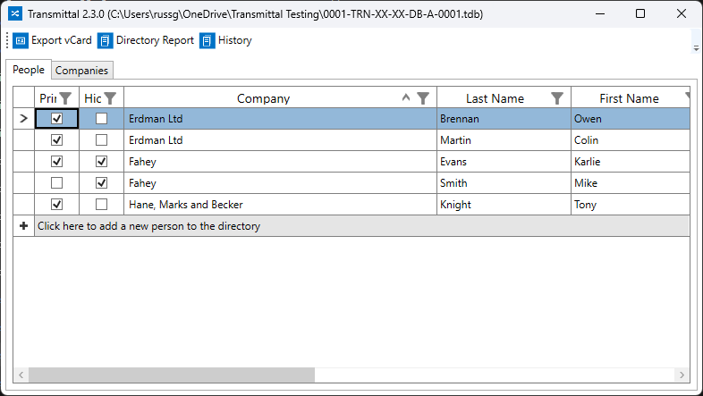

The project directory screen is where database records can be created or edited for the people being recorded as having received transmittals. 

Records can be exported as vCards into Outlook.

A project directory report can be generated for export to PDF, Word or Excel.  The first column in the people datagrid determines whether or not that person appears on the directory report. The second column determines if the person appears in the transmittal distrubution list. Deselected people who may have left the project helps keep things manageable.

The history report will generate the Transmittal Summary report for the selected person.

Clicking into a cell allows the values to be edited. Use the <kbd>Esc</kbd> key to cancel a change or simply <kbd>Tab</kbd> into another cell to finish editing. 

When adding a new row, <kbd>Tab</kbd> or click between cells then click the pencil icon in the header column or press <kbd>Enter</kbd> to finish entering the new row.

A company can be deleted only if no people are assigned to it.

People can be deleted only if no transmittals arre recorded to them.
